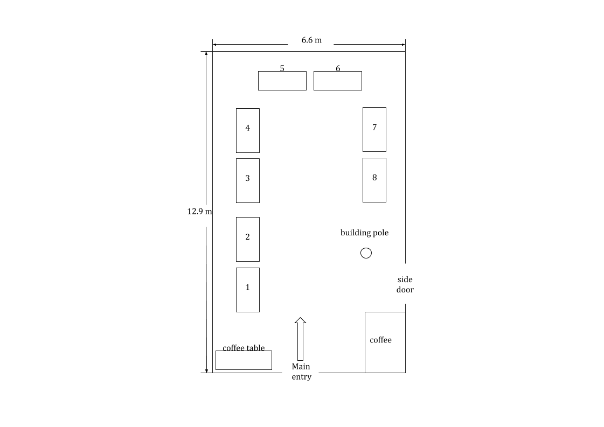

## Exhibitor Information ##

CWIT 2015 are pleased to invite you and your company to be an exhibitor at this year’s workshop. CWIT 2015 provides you with several excellent opportunities to showcase your organization's products and services in this relaxed yet professional setting at Memorial University. To give you maximum exposure to workshop attendees of representatives from government, businesses, universities, and students, we offer events such as the Welcome Reception.

We offer excellent booth space in the main exhibit area. Booths will be filled strictly on a first come, first served basis. The fee for each 180 cm x 90 cm or 152 cm x 86 cm booth is $600, with the possibility of combining two booths at the rate of $1,200.

In addition to exhibiting to workshop attendees, the exhibit area will be open and advertised to all faculty members of Memorial. If you have any questions about exhibiting at CWIT 2015, please email Weimin Huang at weimin@mun.ca.

### Exhibit Space ###

The following are the characteristics of exhibit space:

* Dimensions: 180 cm x 90 cm or 152 cm x 86 cm.
* Furnishings: skirted exhibitor table and chairs 
* One complimentary conference registration (banquet included) 
* Admission to the conference plenary sessions
* A link to your company’s web site from the CWIT 2015 web site
* Two coffee breaks each day 

Not included in the rental price:

* Internet service
* Security service
* Receiving, installation, dismantling, or storage of exhibit

### Exhibition Floor Plan

