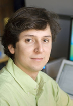

## Invited  Speakers ##

###Andrew Eckford###  
*York University, Canada*

*Abstract:* TBA

*Title:* TBA

###Milica Stojanovic###
*Northeastern University, USA*

*Title:* Underwater Wireless Communication: An Overview of Challenges and Recent Results

*Abstract:* Underwater wireless communications rely on transmission of acoustic waves, since electro-magnetic waves propagate only over very short distances. Acoustic communications thus form an integral part of autonomous undersea systems, which find application in basic sciences (oceanography, marine biology), industry (off-shore oil, aquaculture), environment monitoring (climate, pollution, seismic disturbances) and security (search-and-rescue, surveillance). 

Acoustic waves, however, are confined to low frequencies (usually no more than several tens of kHz) because of energy absorption, and the bandwidth available for communication is extremely limited. Sound travels underwater at a very low speed (nominally 1500 m/s) and propagation occurs over multiple paths. Delay spreading over tens or even hundreds of milliseconds results in a frequency-selective signal distortion, while motion creates an extreme Doppler effect. The worst properties of radio channels—poor link quality of a mobile terrestrial channel, and long delay of a satellite channel—are thus combined in an underwater acoustic channel, which is often said to be the most difficult communication medium in use today.

The quest for bandwidth-efficient acoustic communications has progressed over the past two decades from an initial feasibility proof of phase-coherent detection, to the development of the first high-speed acoustic modem, and finally to a plethora of innovative solutions on both the signal processing and the networking fronts. In this presentation, we begin with an overview of channel characteristics, focusing on the major differences between underwater acoustic and terrestrial radio channels. We follow with a discussion of signal processing methods, briefly overviewing single-carrier broadband equalization used in an existing acoustic modem, and focusing on recent research results in multi-carrier signal detection on highly time-varying, Doppler-distorted channels. The performance of various techniques is illustrated through experimental results, which include transmissions over few kilometers in shallow water to hundreds of kilometers in deep water, at highest bit-rates demonstrated to date. We conclude by outlining the open research problems.

*Bio:* Milica Stojanovic graduated from the University of Belgrade, Serbia, in 1988, and received the M.S. and Ph.D. degrees in electrical engineering from Northeastern University in Boston, in 1991 and 1993. She was a Principal Scientist at the Massachusetts Institute of Technology, and in 2008 joined Northeastern University, where she is currently a Professor of electrical and computer engineering. She is also a Guest Investigator at the Woods Hole Oceanographic Institution. Her research interests include digital communications theory, statistical signal processing and wireless networks, and their applications to underwater acoustic systems. Milica is a Fellow of the IEEE, and serves as an Associate Editor for its Journal of Oceanic Engineering (and in the past for Transactions on Signal Processing and Transactions on Vehicular Technology). She also serves on the Advisory Board of the IEEE Communication Letters, and chairs the IEEE Ocean Engineering Society’s Technical Committee for Underwater Communication, Navigation and Positioning.

###Sarah Katie Wilson###  
*Santa Clara University, USA*

*Title:* Shine a Light: Optical Wireless Communications

*Abstract:* For the past  twenty years, wireless radio frequency local area networks (LANs) have operated successfully in the  2.4 GHz band and the 5 GHz bands. Signals from  these bands do not confine themselves to a given room or even household,so security and frequency re-use are issues for concern. An alternative to radio frequency LANs are diffuse intensity-modulated wireless optical LANs. Optical wireless LANs are more secure than radio waves as light does not move through walls. In addition because this method of communications will use available LED-based office lighting  to send information, it is an environmentally-friendly technology. This talk will focus on efficient methods for using diffuse  optical wireless communications. Issues such as complexity, efficiency and the ability to operate in environments with intensity-limited lighting will be discussed.

*Bio:* Sarah Kate Wilson received her A.B. from Bryn Mawr College with honours in Mathematics in 1979 and her Ph.D. from Stanford University in Electrical Engineering in 1994. She has worked in both industry and academia and has been a visiting professor at Lulea University of Technology, the Royal Institute of Technology in Stockholm,  Stanford University and Northeastern University.  She is an Associate Professor at Santa Clara University. She has served as an Editor for IEEE Transactions on Wireless Communications, IEEE Communications Letters and IEEE Transactions on Communications and  the Editor-in-Chief of IEEE Communications Letters. She is a Fellow of the IEEE and the Vice-President for Publications  of the IEEE Communications Society.

###Shu Lin###
*University of California, Davis*

*Title:* A Broader View of the Superposition Construction of LDPC Codes
 
*Abstract:* LDPC codes, discovered by Gallager in 1962 and rediscovered in late 1990’s, are currently the most promising coding technique to achieve close to the Shannon capacities for a wide range of channels. Since their rediscovery, many methods for constructing LDPC codes have been proposed. Major construction methods can be classified in to two general categories, the algebraic-based and the graph-based constructions. The superposition (SP) construction is one of the earliest algebraic-based methods for constructing LDPC codes which was proposed in 2002. In this presentation, this specific algebraic-based construction method is re-interpreted in a broader view which includes both algebraic (or matrix-theoretic) and graph-theoretic point of views. From the algebraic point of view, it is shown that the SP-construction of LDPC codes covers several major algebraic construction methods developed after 2002 as special cases. From the graph-theoretic point of view, it shown that the protograph (PTG)- based construction of LDPC code, introduced in 2003, is a special case of the superposition construction. In fact, the PTG-based construction of LDPC codes can be viewed as an algebraic construction. This significantly simplifies the construction of LDPC codes based on protographs.

*Bio:* Shu Lin (S’62-M’65-SM’78-F’80-LF’00) received the B.S.E.E. degree from the National Taiwan University, Taipei, Taiwan, in 1959, and the M.S. and Ph.D. degrees in electrical engineering from Rice University, Houston, TX, in 1964 and 1965, respectively. In 1965, he joined the Faculty of the University of Hawaii, Honolulu, as an Assistant Professor of Electrical Engineering. He became an Associate Professor in 1969 and a Professor in 1973. In 1986, he joined Texas A&amp;M University, College Station, as the Irma Runyon Chair Professor of Electrical Engineering. In 1987, he returned to the University of Hawaii. From 1978 to 1979, he was a Visiting Scientist at the IBM Thomas J. Watson Research Center, Yorktown Heights, NY, where he worked on error control protocols for data communication systems. He spent the academic year of 1996-1997 as a Visiting Chair Professor at the Technical University of Munich, Munich, Germany.

He retired from University of Hawaii in 1999 and he is currently an Adjunct Professor at University of California, Davis, California. He has published at least 800 technical papers in prestigious refereed technical journals and international conference proceedings. He is the author of the book, An Introduction to Error-Correcting Codes (Englewood Cliff, NJ: Prentice-Hall, 1970). He also co-authored (with D. J. Costello) the book, Error Control Coding: Fundamentals and Applications (Upper Saddle River, NJ: Prentice-Hall, 1st edition, 1982, 2nd edition, 2004), the book (with T. Kasami, T. Fujiwara, and M. Fossorier), Trellises and Trellis-Based Decoding Algorithms, (Boston, MA: Kluwer Academic, 1998), and the book, Channel Codes: Classical and Modern (Cambridge University Press 2009).

Dr. Lin was elected to IEEE (Institute of Electrical and Electronic Engineering) Fellow in 1980 and Life Fellow in 2000. In 1996, he was a recipient of the Alexander von Humboldt Research Prize for U.S. Senior Scientists and a recipient of the IEEE Third-Millennium Medal, 2000. In 2007, he was a recipient of The Communications Society Stephen O. Rice Prize in the Field of Communications Theory. In 2014, he was awarded the NASA Exceptional Public Achievement Medal.

### Alex Alvarado ###
*University College, London, UK*

*Title:* Coding and Modulation for Optical Communication Systems: Replacing the Soft FEC Limit Paradigm

*Abstract:* The demand for global IP communication bandwidth is continuously growing at a current estimated rate of approximately 20% per year. Most of this demand is met by optical fiber communications, which transports over 95% of all digital data traffic around the globe. Optical fibers were traditionally viewed as a medium with unlimited capacity. However, in recent years, the seemingly never-ending data traffic increase together with the impact of fiber nonlinearities have created the need to increase the spectral efficiency of coherent optical transceivers. 

Forward error correction (FEC) and multilevel modulation formats are one of the key technologies for realizing high spectral efficiencies in optical communications. The combination of FEC and multilevel modulation is known as coded modulation, where FEC is used to recover the sensitivity loss caused by the nonbinary modulation. While in the past optical communication systems were based on hard-decision FEC, modern systems use soft-decision FEC, such as turbo product codes or low-density parity-check codes.

To meet higher-layer quality of service requirements, the bit-error rate (BER) target after decoding (post-FEC BER) is typically around 10^-15. Since such low BER values cannot be reliably estimated by Monte-Carlo simulations or experiments with offline digital signal processing, the conventional design paradigm has been to simulate the system without FEC encoding and decoding, and optimize it for a much higher BER requirement, the so-called "FEC limit" or "FEC threshold". Under this paradigm, the existence of a FEC code that brings down the BER after decoding to the desired target level is assumed. 

In this talk, we challenge the FEC limit paradigm and show that the concept of a channel-independent FEC limit is invalid for soft-decision bit-wise decoding and low to medium code rates. A better predictor is the generalized mutual information (GMI), which is shown to give consistent post-FEC BER predictions across different channel conditions and modulation formats. The "GMI threshold" paradigm is suggested as the relevant design tool for modern optical communication systems. Extensive optical full-field simulations and experiments in both the linear and nonlinear transmission regimes confirm the theoretical analysis.

*Bio:* Alex Alvarado was born in 1982 in Quellón, on the island of Chiloé, Chile. He obtained his Electronic Engineering Diploma (Ingeniero Civil Electrónico) and his Master of Science in Electronic Engineering (Magíster en Ciencias de la Ingeniería Electrónica) from the Departamento de Electrónica, Universidad Técnica Federico Santa María (UTFSM), Chile, in 2003 and 2005, respectively. He obtained the degree of Licentiate of Engineering (Teknologie Licentiatexamen) in 2008 and his PhD degree in 2011, both of them from Chalmers University of Technology, Gothenburg, Sweden.
 
Dr. Alvarado is currently a Senior Research Associate at the Optical Networks Group, University College London, United Kingdom. In 2012-2014 he was a Marie Curie Intra-European Fellow at the University of Cambridge, United Kingdom, and during 2011-2012 he was a Newton International Fellow at the same institution. His general research interests are in the areas of digital communications, coding, and information theory.

### Sofiène Affes ###
*INRS, Canada*

*Title:* Efficient Distributed Collaborative Beamforming Designs for Real-World Applications

*Abstract:* Collaborative beamforming (CB), alternatively known as cooperative multi-antenna relaying, stands out today as a strong means to increase coverage, reliability, and capacity of various wireless networks by implementing through a set of terminals (sensor nodes, mobiles, network relays, soldier radios, vehicles, etc.) dual-hop transmissions between transmitter-receiver pairs when direct links would otherwise fail. Distributed CB (DCB) designs, in particular, lend themselves to distributed processing implementations that avoid the costly overhead required otherwise to broadcast the CB weights after their calculation by some master terminals. Many impediments stand, however, between the exciting concept of DCB and its real-world and wide-use applicability. In this talk, we present novel DCB designs, obtained in closed form, that dot require any data exchange between terminals, yet properly cope, as dictated by a broad range of applications, with both scattered and interfered multi-antenna dual-hop transmissions under different power constraints. We also analyze the performance of these new DCB designs in terms of SNR and link-level throughput, both by newly established theoretical closed-form expressions and simulations. to illustrate their spectrum, power, and computational-cost efficiency in operating conditions that account for various implementation imperfections.

*Bio:* Sofiène Affes received the Diplôme d’Ingénieur in telecommunications in 1992, and the Ph.D. degree in signal processing with honors in 1995, both from École Nationale Supérieure des Télécommunications (ENST), Paris, France. He has been since with INRS, Canada, as a Research Associate till 1997, an Assistant Professor till 2000, and Associate Professor till 2009. Currently he is Full Professor and Director of PERWADE, a unique 4M$ research training program on wireless in Canada. His research interests are in wireless communications, radio access technologies, statistical signal and array processing, and parameter estimation (www.wirelesslab.ca). Dr Affes has been twice the recipient of a Discovery Accelerator Supplement Award from NSERC, from 2008 to 2011, and from 2013 to 2016. From 2003 to 2013, he held a Canada Research Chair in Wireless Communications. In 2006, he served as a General Co-Chair of IEEE VTC’2006-Fall, Montreal, Canada. In 2008 he received from the IEEE Vehicular Technology Society the IEEE VTC Chair Recognition Award for exemplary contributions to the success of IEEE VTC. He served or is currently serving on different Editorial Boards, TPCs, and Selection Committees. He now acts as a General Chair of the 15th edition of IEEE ICWUB to be held in Montreal in October 2015.
