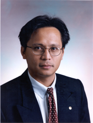

## Plenary Speakers ##

###Monique Morrow###  
*CTO Cisco Services*

*Abstract:* Through her own journey, Monique will describe the key attributes in particular passion and self-confidence, that we all need to impart to the new generation of engineers and computer scientists. Moving out of one's comfort zone is the sweet spot for growth.  Will you move yourself or will you be moved? What do you want to do with technology? These are questions Monique will pose whilst describing her journey along the way, A journey that still continues!

*Title:* The Making of a 21st Century Technology Leader

*Bio:* Monique Morrow is the CTO of Cisco Services. In her role, she leads the development of strategic technology and business architectures for Cisco customers and partners. Current focus areas include:  M2M Security; eHealth; next generation software architecture and machine learning algorithms. ([Full Bio](files/morrow.pdf)).

###Vahid Tarokh###
*Harvard University*

*Title:* Complementary Lattice Arrays

*Bio:* Vahid Tarokh received the Ph.D. in Electrical Engineering from the University of Waterloo, Ontario, Canada in 1995. He then worked at AT&T Labs-Research until August 2000 as Member, Principal Member of Technical Staff, and finally as the Head of the Department of Wireless Communications and Signal Processing.  In Sept 2000, he joined MIT as an Associate Professor of Electrical Engineering. In June 2002, he joined Harvard University, where he is a Professor of Applied Mathematics. His current research areas are in stochastic processes, pseudo-randomness, free probability, machine learning and data analysis.  He has received a Guggenheim Fellowship in Applied Mathematics (for his results on pseudo-randomness), and holds three honorary degrees.

###Moe Win###  
*Massachusetts Institute of Technology*

*Title:* Fundamental Limits of Network Localization and Navigation

*Abstract:* The availability of positional information is of extreme importance in numerous wireless applications. The coming years will see the emergence of location-aware networks with sub-meter localization accuracy, minimal infrastructure, and robustness in harsh (GPS challenged) environments. To reach this goal we advocate network localization and navigation, a new paradigm that exploits a combination of wideband transmission and spatiotemporal cooperation. Our work has addressed this problem from three perspectives: theoretical framework, cooperative algorithms, and network experimentation. We will give an overview of our recent research results in this exciting field, with particular emphasis on theoretical foundation.

*Bio:* Moe Win is a Professor at the Massachusetts Institute of Technology (MIT). Prior to joining MIT, he was with AT&T Research Laboratories for five years and with the Jet Propulsion Laboratory for seven years. His research encompasses fundamental theories, algorithm design, and experimentation for a broad range of real-world problems. His current research topics include network localization and navigation, network interference exploitation, intrinsic wireless network secrecy, adaptive diversity techniques, and ultra-wide bandwidth systems.

Professor Win is a Fellow of the AAAS, the IEEE, and the IET, and was an IEEE Distinguished Lecturer. He is an elected Member-at-Large on the IEEE Communications Society Board of Governors (2011 - 2013). He was the Chair (2004 - 2006) and Secretary (2002 - 2004) for the Radio Communications Committee of the IEEE Communications Society. He was honored with two IEEE Technical Field Awards: the IEEE Kiyo Tomiyasu Award and the IEEE Eric E. Sumner Award (jointly with Professor R. A. Scholtz). He received the International Prize for Communications Cristoforo Colombo, the Copernicus Fellowship, the Royal Academy of Engineering Distinguished Visiting Fellowship, the Fulbright Fellowship, the Laurea Honoris Causa from the University of Ferrara, and the U.S. Presidential Early Career Award for Scientists and Engineers. 
