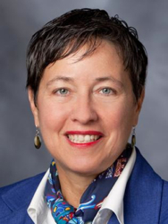
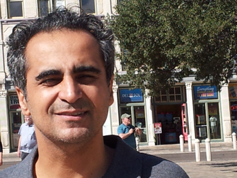

## Plenary Speakers ##

###Monique Morrow###  
*CTO Cisco Services*

*Title:* The Making of a 21st Century Technology Leader

*Bio:* Monique Morrow is the CTO of Cisco Services. In her role, she leads the development of strategic technology and business architectures for Cisco customers and partners. Current focus areas include:  M2M Security; eHealth; next generation software architecture and machine learning algorithms. ([Full Bio](files/morrow.pdf)).

###Vahid Tarokh###
*Harvard University*

*Title:* Complementary Lattice Arrays

*Bio:* Vahid Tarokh received the Ph.D. in Electrical Engineering from the University of Waterloo, Ontario, Canada in 1995. He then worked at AT&T Labs-Research until August 2000 as Member, Principal Member of Technical Staff, and finally as the Head of the Department of Wireless Communications and Signal Processing.  In Sept 2000, he joined MIT as an Associate Professor of Electrical Engineering. In June 2002, he joined Harvard University, where he is a Professor of Applied Mathematics. His current research areas are in stochastic processes, pseudo-randomness, free probability, machine learning and data analysis.  He has received a Guggenheim Fellowship in Applied Mathematics (for his results on pseudo-randomness), and holds three honorary degrees.

###Moe Win###  
*Massachusetts Institute of Technology*

*Title:* To be annouced.
